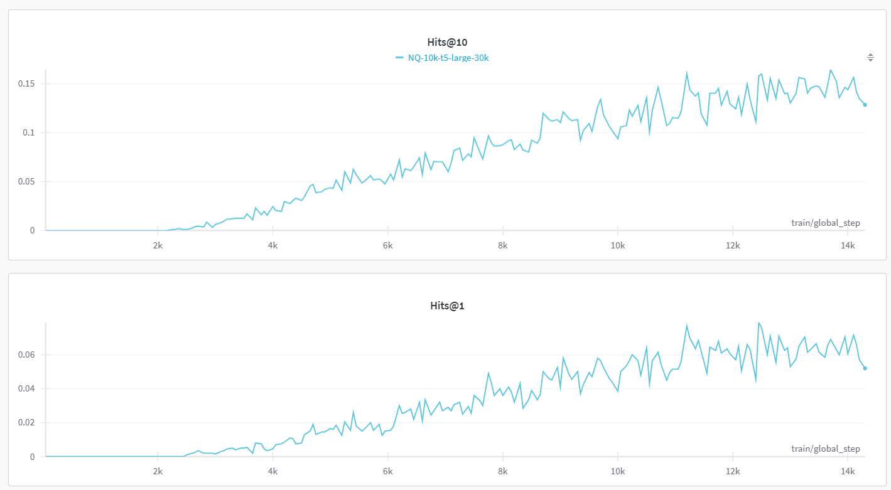

# DSI-transformers
A huggingface transformers implementation of [Transformer Memory as a Differentiable Search Index](https://arxiv.org/abs/2202.06991), Yi Tay, Vinh Q. Tran, Mostafa Dehghani, Jianmo Ni, Dara Bahri, Harsh Mehta, Zhen Qin, Kai Hui, Zhe Zhao, Jai Gupta, Tal Schuster, William W. Cohen, Donald Metzler

Requirements: `python=3.8` `transformers=4.17.0` `datasets=1.18.3` `wandb`
> Note: This is not the official repository.

## Goal of this repository
Reproduce the results of DSI Large, Naive String Docid, NQ10K. According to Table 3 in the original paper, we should have `Hits@1=0.347`,`Hits@10=0.605`

### Step1: Create NQ10K training (indexing) and validation datasets

```
cd data/NQ
python create_NQ_train_vali.py
```

### Step2: Run training script
cd back to the root directory and run:

```
python train.py
```
Training can be run with a single L40s GPU for 50 epochs . We use [wandb](https://wandb.ai/site) to log the Hits scores during training:


